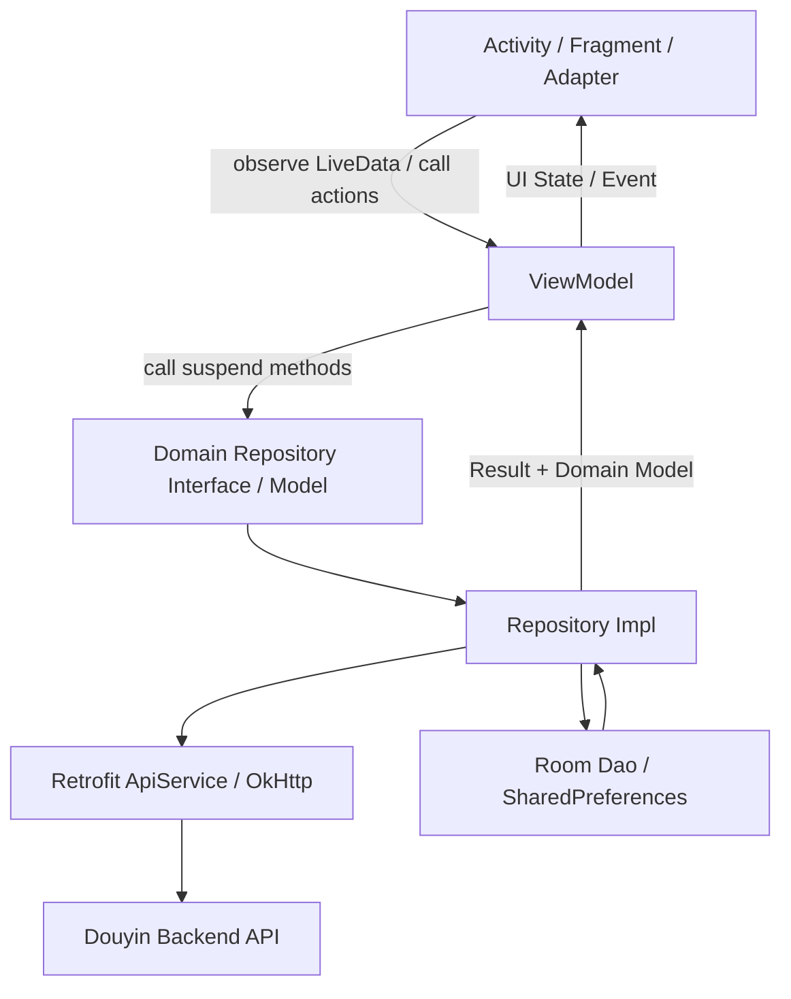
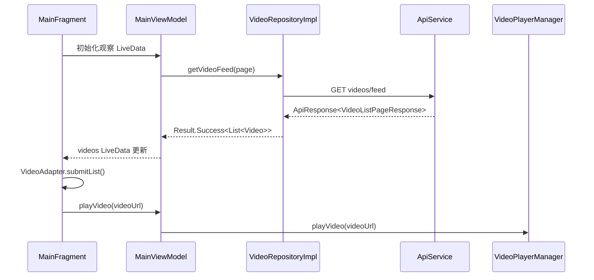
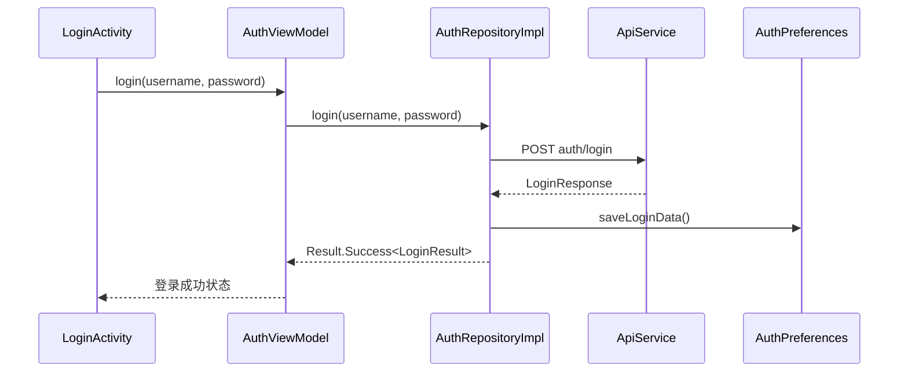

# Android 客户端架构技术文档

## 1. 文档概述

本文档描述 `douyinAndroid` Android 客户端的当前技术架构、模块职责、核心数据流、网络与本地存储设计、视频播放方案、登录鉴权方案以及后续演进建议。文档以当前代码实现为准，适用于开发接手、功能扩展、联调排查和架构评审。

客户端工程路径：

```text
douyinAndroid/
└── app/
    └── src/main/java/com/example/douyinandroid/
```

当前客户端采用单 App Module 组织方式，代码在包内按职责分层：

```text
com.example.douyinandroid
├── common/                 # 通用扩展与工具
├── core/                   # 基础能力：网络、数据库、鉴权、视频播放、服务定位
├── data/                   # Repository 实现，负责数据获取与模型转换
├── domain/                 # 领域模型与 Repository 接口
└── feature/                # 业务功能：登录注册、首页视频流、发布
```

## 2. 技术栈

| 类别 | 技术选型 | 当前用途 |
| --- | --- | --- |
| 语言 | Kotlin | 客户端主要开发语言 |
| UI | Android View + XML + ViewBinding | 页面布局与视图绑定 |
| 架构组件 | ViewModel、LiveData、Lifecycle、Fragment | UI 状态管理与生命周期感知 |
| 异步 | Kotlin Coroutines | Repository 网络与数据库 IO 调度 |
| 网络 | Retrofit、OkHttp、Gson | HTTP API 调用、拦截器、JSON 解析 |
| 本地数据库 | Room | 视频、用户、缓存、关注、点赞、历史等本地数据表 |
| 本地偏好 | SharedPreferences | Token、用户登录信息持久化 |
| 视频播放 | AndroidX Media3 ExoPlayer | 首页短视频播放、暂停、循环播放 |
| 图片加载 | Glide | 图片资源加载 |
| 路由 | ARouter | 应用初始化中接入，当前页面跳转仍以显式 Intent 为主 |
| 列表交互 | ViewPager2、RecyclerView | 垂直视频流切换 |
| 构建 | Gradle Kotlin DSL、KSP | Android 构建、Room/Glide 注解处理 |

基础构建配置：

- `compileSdk`: 36.1
- `minSdk`: 29
- `targetSdk`: 36
- `Java/Kotlin JVM`: 17
- `applicationId`: `com.example.douyinandroid`

## 3. 总体架构

客户端整体采用接近 MVVM + Repository 的分层结构：



分层职责如下：

| 层级 | 代码位置 | 主要职责 |
| --- | --- | --- |
| UI 层 | `feature/**/ui`、`res/layout` | 页面渲染、用户交互、列表/弹窗/播放控件绑定 |
| ViewModel 层 | `feature/**/ui/*ViewModel.kt` | 页面状态、分页、加载状态、一次性事件、协程调度入口 |
| Domain 层 | `domain/model`、`domain/repository` | 业务模型和仓库接口，隔离 UI 与数据实现 |
| Data 层 | `data/repository` | 调用远端 API/本地 Dao，处理异常，完成网络模型到领域模型转换 |
| Core 层 | `core/**` | 网络客户端、数据库、鉴权存储、播放器、服务注册 |
| Common 层 | `common/**` | 日志、扩展方法等通用能力 |

## 4. 应用启动与依赖管理

应用入口为 `DouyinApp`，在 `Application.onCreate()` 中完成全局初始化：

```text
DouyinApp.onCreate()
├── initARouter()
├── initRetrofit()
├── initServiceLocator()
└── initVideoPlayer()
```

### 4.1 Application 初始化

`DouyinApp` 的职责包括：

- 初始化 ARouter，并在 Debug 模式开启日志与调试能力。
- 初始化 `RetrofitClient`，使网络层持有 `AuthPreferences`。
- 创建 Room 数据库实例。
- 创建并注册 `ApiService`、Dao、Repository、`AuthPreferences`。
- 初始化全局 `VideoPlayerManager`。

### 4.2 ServiceLocator

当前项目没有引入 Hilt/Koin 等 DI 框架，而是通过自定义 `ServiceLocator` 维护全局服务表：

```kotlin
object ServiceLocator {
    private val services = mutableMapOf<Class<*>, Any>()
}
```

典型注册关系：

```text
AuthPreferences
ApiService
VideoDao / UserDao
VideoRepository / UserRepository / PublishRepository / AuthRepository
```

ViewModelFactory 从 `ServiceLocator` 获取 Repository，再注入到 ViewModel。该方式简单直接，适合当前规模；当功能模块增多、依赖关系复杂后，可考虑迁移到 Hilt，以获得编译期校验、生命周期 Scope 管理和测试替换能力。

## 5. 功能模块架构

当前已实现或接入的主要 Feature：

```text
feature/
├── feature_auth/       # 登录、注册
├── feature_main/       # 首页视频流、点赞、评论、分享
└── feature_publish/    # 视频发布、封面上传
```

### 5.1 首页视频流模块

核心类：

- `MainActivity`: 应用主入口，检查登录状态，未登录则进入登录页。
- `MainFragment`: 首页视频流 UI，承载 ViewPager2、刷新、错误页、评论弹窗、分享弹窗。
- `MainViewModel`: 视频列表分页、刷新、点赞、评论、分享、播放状态控制。
- `VideoAdapter`: 视频卡片渲染与当前播放位置绑定。
- `VideoPlayerManager`: 全局 ExoPlayer 管理。

首页数据流：



分页策略：

- `nextPage` 从 1 开始。
- `hasMore` 根据本次返回列表是否为空判断。
- ViewPager 滑动到距离末尾 3 条以内时触发 `loadMoreVideos()`。
- 下拉刷新时重置页码、清空旧列表并滚动到第一条。

互动策略：

- 点赞/取消点赞由 `MainViewModel.likeVideo()` 触发。
- Repository 成功返回后，ViewModel 在内存列表中乐观更新 `isLiked` 与 `likeCount`。
- 评论通过 BottomSheetDialog 展示，评论成功后将新评论插入当前评论列表头部，并更新视频评论数。
- 分享接口当前通过查询视频详情获得 `videoUrl`，再调用系统分享或剪贴板。

### 5.2 登录注册模块

核心类：

- `LoginActivity`
- `RegisterActivity`
- `AuthViewModel`
- `AuthRepositoryImpl`
- `AuthPreferences`

登录流程：



登录态判断：

- `AuthPreferences.isLoggedIn` 依据 `token` 非空且 `userId != -1L` 判断。
- `MainActivity.onCreate()` 中如果未登录，先进入 `LoginActivity`。
- 登录成功后回到主页面并加载 `MainFragment`。

### 5.3 发布模块

核心类：

- `PublishActivity`
- `PublishFragment`
- `PublishViewModel`
- `PublishRepositoryImpl`
- `ProgressRequestBody` / `ContentUriRequestBody`

发布模块负责将本地 `Uri` 转为 Multipart 请求：

- 根据 `ContentResolver.getType(uri)` 或文件扩展名推断 MIME。
- 视频文件使用表单字段 `file` 上传。
- 可选封面使用表单字段 `cover` 上传。
- 标题、描述、话题、位置等作为文本 Part 上传。
- 上传进度通过自定义 RequestBody 回调给 ViewModel/UI。

## 6. 网络架构

网络层位于：

```text
core/core_network/network/
├── ApiConstants.kt
├── ApiService.kt
├── RetrofitClient.kt
├── ProgressRequestBody.kt
├── exception/ApiException.kt
├── interceptor/
│   ├── AuthInterceptor.kt
│   ├── ErrorInterceptor.kt
│   └── LogInterceptor.kt
└── bean/
```

### 6.1 RetrofitClient

`RetrofitClient` 是网络层单例，负责构建：

- `OkHttpClient`
- `Retrofit`
- `ApiService`

关键配置：

- `BASE_URL`: `http://192.168.31.105:8080/api/v1/`
- 超时时间：30 秒
- Debug 环境开启 OkHttp Header 日志，并隐藏 `Authorization`
- 启用连接失败重试

### 6.2 ApiService

`ApiService` 统一声明后端接口，当前覆盖：

- 视频流、视频详情、删除、点赞、收藏、用户视频、评论列表
- 注册、登录、刷新 Token、退出登录
- 用户信息、关注/取消关注、粉丝/关注列表
- 评论创建、删除、点赞
- 视频上传、通用文件上传

接口统一返回：

```kotlin
ApiResponse<T>
```

Repository 层根据 `response.isSuccess` 与 `response.data` 转换为领域层 `Result<T>`。

### 6.3 拦截器

`AuthInterceptor` 为每个请求追加通用 Header：

- `Content-Type: application/json`
- `Accept: application/json`
- `X-Platform: android`
- `X-App-Version`
- `X-Device-Id`
- `Authorization: Bearer <token>`，登录后才追加

`ErrorInterceptor` 和日志拦截器负责统一错误与请求日志。业务异常最终在 Repository 中被捕获并包装为 `Result.Error`。

## 7. 本地存储架构

### 7.1 Room 数据库

数据库位于：

```text
core/core_database/database/
├── AppDatabase.kt
├── dao/
│   ├── UserDao.kt
│   └── VideoDao.kt
└── entity/
    └── Entities.kt
```

数据库名称：

```text
douyin_database
```

当前实体：

- `VideoEntity`
- `UserEntity`
- `CacheEntity`
- `FollowEntity`
- `LikeEntity`
- `HistoryEntity`

`AppDatabase` 使用单例模式创建，版本号为 1，并设置 `fallbackToDestructiveMigration()`。这意味着数据库结构变更时会直接清空重建，开发期方便，但生产环境需要替换为正式 Migration。

### 7.2 SharedPreferences

`AuthPreferences` 使用 `douyin_auth_prefs` 保存登录信息：

- token
- refreshToken
- userId
- username
- nickname
- avatar
- tokenExpiresAt

登录、注册、刷新 Token 成功后写入；退出登录时清除本地登录态。

## 8. 视频播放架构

视频播放核心为 `VideoPlayerManager`，基于 Media3 ExoPlayer 封装单例播放器。

主要能力：

- 全局持有一个 `ExoPlayer` 实例。
- `repeatMode = Player.REPEAT_MODE_ONE`，短视频单条循环播放。
- 通过 `playVideo(videoUrl)` 切换播放源。
- 相同视频重复播放时直接恢复播放，避免重复 prepare。
- 暴露 `pause()`、`resume()`、`seekTo()`、`getCurrentPosition()`、`isPlaying()` 等控制方法。
- 通过 `PlayerListener` 向 UI 反馈缓冲、就绪、结束、错误等状态。

首页播放绑定策略：

```text
ViewPager2 页面选中
└── MainFragment.playVideoAtPosition(position)
    ├── MainViewModel.onVideoChanged(position)
    ├── MainViewModel.playVideo(video.videoUrl)
    └── VideoAdapter.setCurrentPlayingPosition(position, player)
```

生命周期策略：

- `MainFragment.onResume()` 恢复播放。
- `MainFragment.onPause()` 暂停播放。
- `MainActivity.onDestroy()` 和 `DouyinApp.onTerminate()` 释放播放器。

## 9. 领域模型与数据转换

领域模型集中在：

```text
domain/model/Models.kt
```

Repository 接口集中在：

```text
domain/repository/Repositories.kt
```

项目通过领域模型隔离网络 Bean 与数据库 Entity：

```text
Network Bean -> Repository Mapper -> Domain Model -> ViewModel/UI
Room Entity  -> Repository Mapper -> Domain Model -> ViewModel/UI
```

这种方式使 UI 层无需关心接口字段命名、数据库字段或服务端响应细节。当前转换函数主要写在各 Repository 实现文件底部，例如 `VideoRepositoryImpl.kt` 中的 `VideoItem.toDomain()`、`VideoDetailResponse.toDomain()`、`VideoEntity.toDomain()`。

## 10. 错误处理与状态管理

### 10.1 Result 封装

Domain 层使用 `Result` 表达数据加载结果：

```text
Result.Success<T>
Result.Error
Result.Loading
```

Repository 捕获异常并返回 `Result.Error(e, e.message)`，ViewModel 根据结果更新 LiveData。

### 10.2 UI 状态

首页 ViewModel 当前拆分多个 LiveData：

- `videos`
- `isLoading`
- `isRefreshing`
- `error`
- `currentIndex`
- `likeEvent`
- `shareEvent`
- `commentEvent`
- `comments`
- `isCommentsLoading`

这种拆分方式直观，但随着页面复杂度增加，可以逐步收敛为单一 `UiState` 加一次性 `UiEvent`，降低多 LiveData 组合时的状态不一致风险。

## 11. 与后端接口边界

客户端基础 URL 配置在 `ApiConstants.BASE_URL`：

```kotlin
const val BASE_URL = "http://192.168.31.105:8080/api/v1/"
```

当前客户端依赖后端接口路径包括：

| 业务 | 方法与路径 |
| --- | --- |
| 视频流 | `GET videos/feed` |
| 视频详情 | `GET videos/{videoId}` |
| 视频发布 | `POST videos` |
| 点赞/取消点赞 | `POST/DELETE videos/{videoId}/like` |
| 收藏/取消收藏 | `POST/DELETE videos/{videoId}/collect` |
| 评论列表/创建 | `GET/POST videos/{videoId}/comments` |
| 用户视频 | `GET videos/user/{userId}` |
| 登录注册 | `POST auth/login`、`POST auth/register` |
| Token 刷新 | `POST auth/refresh` |
| 退出登录 | `POST auth/logout` |
| 用户信息 | `GET users/{userId}`、`PUT users/info` |
| 关注关系 | `POST/DELETE users/{userId}/follow` |
| 文件上传 | `POST files/upload` |

联调时需要确认手机或模拟器能够访问 `192.168.31.105:8080`。如果使用 Android 模拟器访问宿主机本地后端，通常需要改为 `10.0.2.2` 或同网段局域网 IP。

## 12. 目录职责说明

```text
douyinAndroid/app/src/main/java/com/example/douyinandroid/
├── DouyinApp.kt
├── MainActivity.kt
├── common/
│   ├── common_ext/Extensions.kt
│   └── common_utils/LogUtil.kt
├── core/
│   ├── ServiceLocator.kt
│   ├── core_auth/AuthPreferences.kt
│   ├── core_database/database/
│   ├── core_network/network/
│   └── core_video/video/VideoPlayerManager.kt
├── data/repository/
│   ├── AuthRepositoryImpl.kt
│   ├── PublishRepositoryImpl.kt
│   ├── UserRepositoryImpl.kt
│   └── VideoRepositoryImpl.kt
├── domain/
│   ├── model/Models.kt
│   └── repository/Repositories.kt
└── feature/
    ├── feature_auth/ui/
    ├── feature_main/ui/
    └── feature_publish/ui/
```

资源目录：

```text
douyinAndroid/app/src/main/res/
├── drawable/       # 图标、渐变、背景
├── layout/         # Activity / Fragment / Item XML
├── mipmap-*/       # Launcher 图标
├── values/         # colors、strings、themes
└── xml/            # 备份与数据提取规则
```

## 13. 架构约束与开发规范建议

### 13.1 分层调用规则

建议保持以下依赖方向：

```text
feature -> domain -> data -> core
```

约束建议：

- UI 层只依赖 ViewModel，不直接调用 `ApiService` 或 Dao。
- ViewModel 只依赖 Domain Repository 接口，不依赖具体实现。
- Repository 负责网络 Bean、Room Entity 和 Domain Model 的转换。
- Core 层提供基础能力，不写业务页面逻辑。

### 13.2 新增接口流程

新增后端接口时建议按以下顺序开发：

1. 在 `ApiConstants.Endpoints` 添加路径常量。
2. 在 `ApiService` 添加 Retrofit 方法。
3. 在 `core_network/network/bean` 添加请求/响应 DTO。
4. 在 `domain/model` 或 `domain/repository` 添加领域模型/接口方法。
5. 在对应 `RepositoryImpl` 实现调用、异常处理和模型转换。
6. 在 ViewModel 中暴露状态。
7. 在 UI 层观察状态并渲染。

### 13.3 新增页面流程

新增功能页建议按以下结构：

```text
feature/feature_xxx/ui/
├── XxxActivity.kt 或 XxxFragment.kt
├── XxxViewModel.kt
├── XxxViewModelFactory.kt
└── XxxUiState.kt
```

如果页面只承载一个 Fragment，可优先使用 Activity + Fragment 的现有模式；如果后续页面层级增多，可统一迁移到 Navigation 或 ARouter。

### 13.4 本地缓存策略

当前 Room 已具备基础表结构，但视频流接口返回后主要直接更新内存列表。后续可增强为：

- 首屏先读本地缓存，再刷新网络。
- 网络成功后写入 `VideoEntity`。
- 点赞、关注等互动先写本地状态，再异步同步。
- 为缓存表增加过期时间和清理策略。

## 14. 当前风险与优化方向

| 项目 | 当前情况 | 建议 |
| --- | --- | --- |
| 依赖注入 | 使用自定义 `ServiceLocator` | 中大型阶段迁移 Hilt，提升依赖可测试性 |
| 数据库迁移 | `fallbackToDestructiveMigration()` | 发布前补充 Room Migration |
| Base URL | 写死局域网 IP | 使用 `BuildConfig` 或 Gradle productFlavor 区分 dev/test/prod |
| Token 刷新 | Repository 提供 refresh 方法，但拦截器未自动刷新 | 在 OkHttp Authenticator 或统一 401 处理里补齐自动刷新 |
| UI 状态 | 多个 LiveData 分散管理 | 可统一为 `UiState` + `UiEvent` |
| 编码显示 | 部分源码中文注释/字符串显示为乱码 | 统一 UTF-8 编码并修复资源字符串 |
| 播放器生命周期 | Activity 和 Application 都有释放逻辑 | 明确播放器归属，避免重复释放导致边界问题 |
| 分享接口 | 当前通过视频详情 URL 替代分享接口 | 后端若提供分享统计接口，应单独接入 |
| 测试覆盖 | 仅有模板测试 | 增加 Repository、ViewModel、接口 Mock 测试 |

## 15. 推荐演进路线

短期优先级：

1. 将 `BASE_URL` 改为 `BuildConfig` 注入，支持不同环境。
2. 修复源码和资源中的中文乱码，统一文件编码。
3. 首页视频流成功后落库，提升弱网和冷启动体验。
4. 补充 ViewModel 单元测试，覆盖分页、刷新、点赞、评论状态。

中期优先级：

1. 引入 Hilt 替代 `ServiceLocator`。
2. 建立统一 `UiState` / `UiEvent` 模式。
3. 完善 Token 自动刷新和 401 退出登录策略。
4. 引入 Repository 层 Mock，形成稳定的客户端联调测试能力。

长期优先级：

1. 根据业务增长拆分多 Gradle Module，例如 `core-network`、`core-database`、`feature-main`。
2. 建立视频预加载与缓存策略。
3. 建立发布链路的后台任务和失败重试机制。
4. 接入性能监控、崩溃监控和播放质量指标。

## 16. 关键文件索引

| 文件 | 说明 |
| --- | --- |
| `douyinAndroid/app/build.gradle.kts` | App 构建配置与依赖声明 |
| `douyinAndroid/app/src/main/java/com/example/douyinandroid/DouyinApp.kt` | Application 初始化入口 |
| `douyinAndroid/app/src/main/java/com/example/douyinandroid/MainActivity.kt` | 主 Activity 与登录态入口判断 |
| `douyinAndroid/app/src/main/java/com/example/douyinandroid/core/ServiceLocator.kt` | 简易服务定位器 |
| `douyinAndroid/app/src/main/java/com/example/douyinandroid/core/core_network/network/RetrofitClient.kt` | Retrofit/OkHttp 单例 |
| `douyinAndroid/app/src/main/java/com/example/douyinandroid/core/core_network/network/ApiService.kt` | 后端 API 声明 |
| `douyinAndroid/app/src/main/java/com/example/douyinandroid/core/core_auth/AuthPreferences.kt` | 登录态本地存储 |
| `douyinAndroid/app/src/main/java/com/example/douyinandroid/core/core_database/database/AppDatabase.kt` | Room 数据库 |
| `douyinAndroid/app/src/main/java/com/example/douyinandroid/core/core_video/video/VideoPlayerManager.kt` | ExoPlayer 播放器封装 |
| `douyinAndroid/app/src/main/java/com/example/douyinandroid/domain/repository/Repositories.kt` | Repository 接口定义 |
| `douyinAndroid/app/src/main/java/com/example/douyinandroid/data/repository/VideoRepositoryImpl.kt` | 视频数据仓库实现 |
| `douyinAndroid/app/src/main/java/com/example/douyinandroid/data/repository/AuthRepositoryImpl.kt` | 登录注册仓库实现 |
| `douyinAndroid/app/src/main/java/com/example/douyinandroid/data/repository/PublishRepositoryImpl.kt` | 视频发布仓库实现 |
| `douyinAndroid/app/src/main/java/com/example/douyinandroid/feature/feature_main/ui/MainViewModel.kt` | 首页业务状态管理 |
| `douyinAndroid/app/src/main/java/com/example/douyinandroid/feature/feature_main/ui/MainFragment.kt` | 首页 UI 与交互 |

---

文档版本：v1.0  
最后更新：2026-04-29
